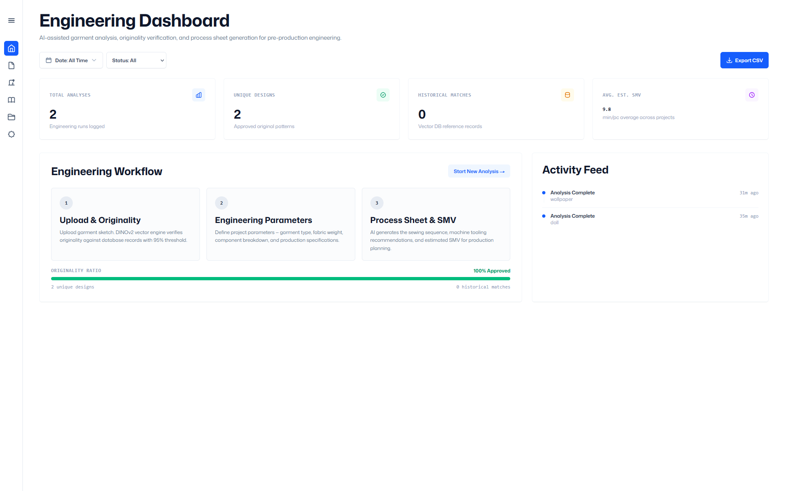
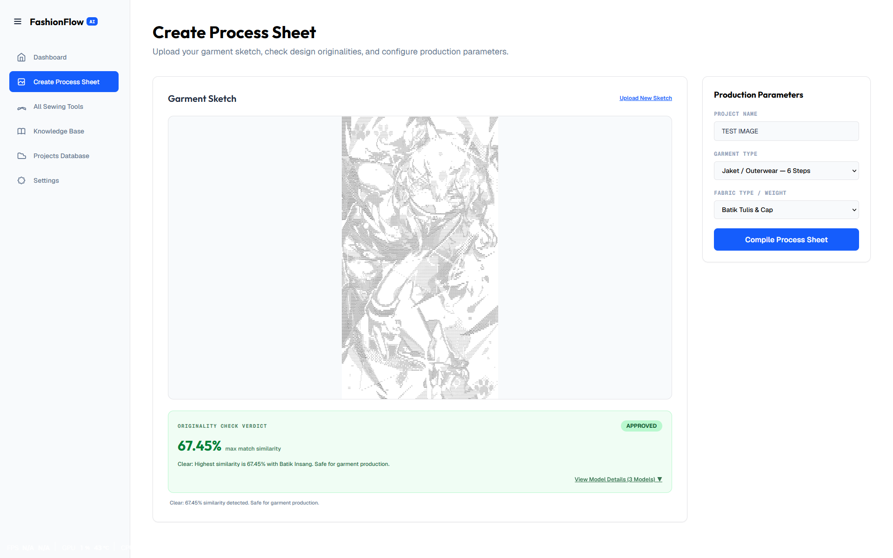
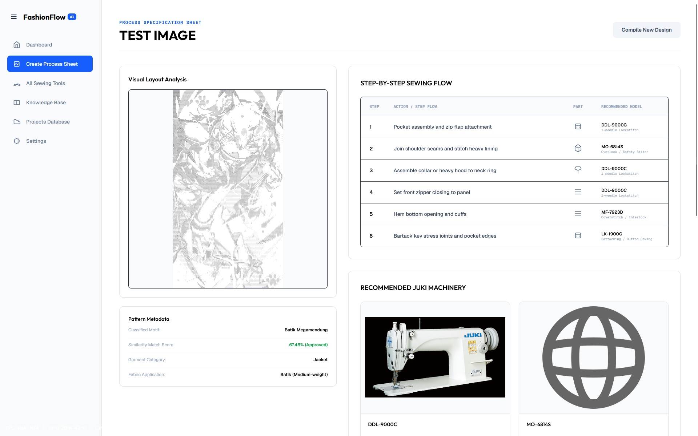
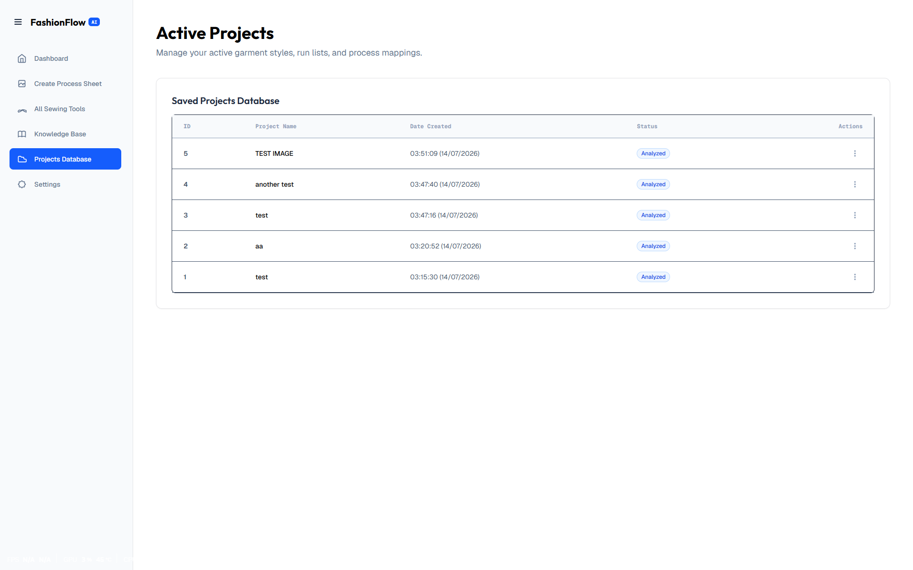
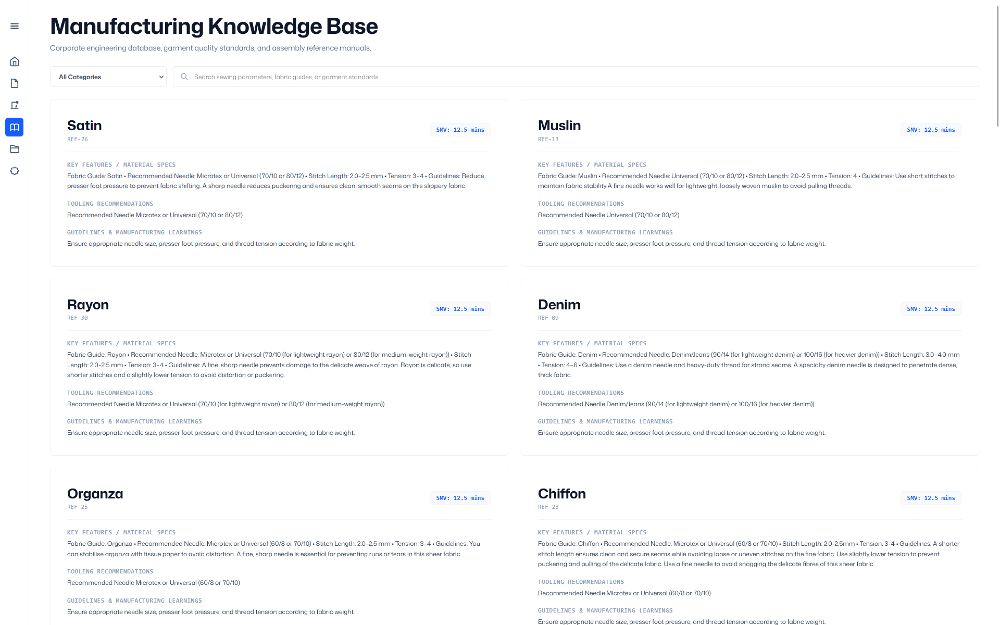
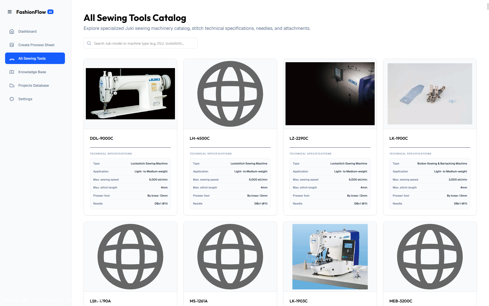
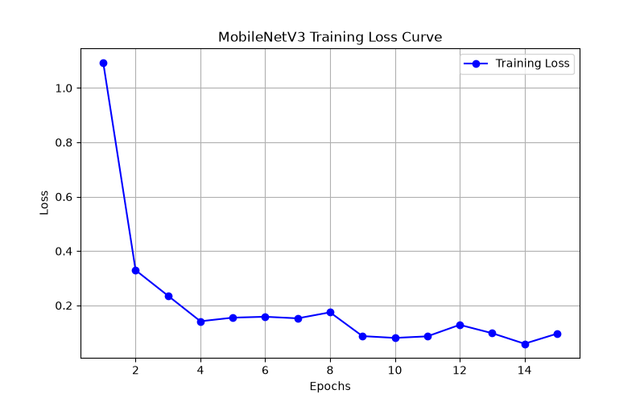
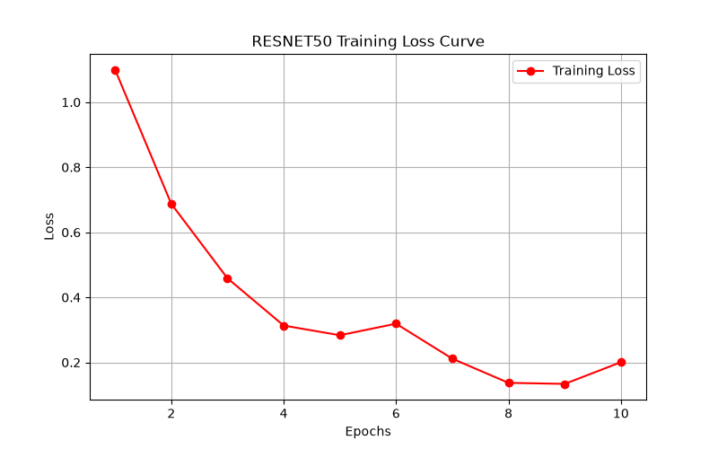
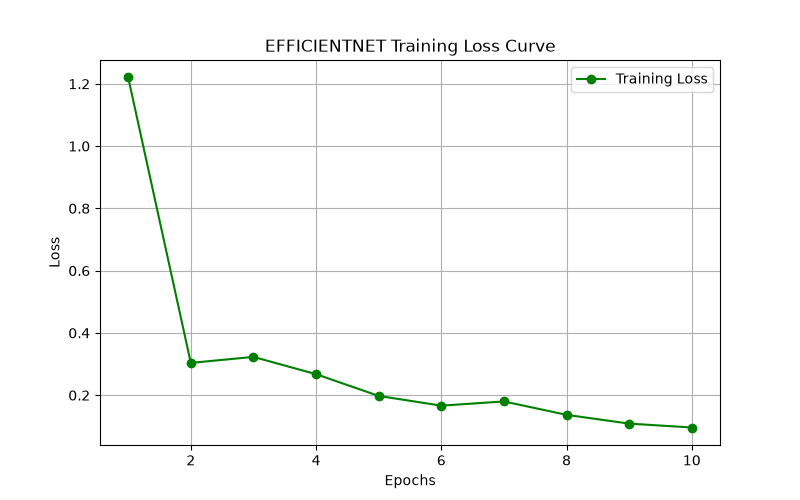

# FashionFlow AI — Garment Production Intelligence System

> **Intelligent pattern recognition + process sheet generation for garment production.**  
> Upload a garment sketch → AI checks design originality via DINOv2 vector retrieval → Fill in parameters → Get a full production spec sheet with sewing steps, Juki machine recommendations, SMV estimates, and Top-3 historical project baselines.

*Last Updated: 2026-07-19 (Native pgvector HNSW Migration)*

---

## 📸 UI Screenshots & Training Results

### Application UI Screenshots

| System Workflow Dashboard | Originality Check & Quiz Form |
|:-:|:-:|
|  |  |

| Process Specification Sheet | Saved Projects Database |
|:-:|:-:|
|  |  |

| Pattern Originality Knowledge Base | All Juki Machinery Catalog |
|:-:|:-:|
|  |  |

### Training Loss Curves & Model Performance

| MobileNetV3 Large | ResNet50 | EfficientNet-B0 |
|:-:|:-:|:-:|
|  |  |  |

> **Pipeline A (Classification Models):** MobileNetV3-Large, ResNet50, and EfficientNet-B0 trained on the **Indonesian Batik Motifs (Corak App)** dataset — 10 batik classes, ~1,200 images — on Google Colab with GPU acceleration. Accuracy: **94.2%** on final validation run.  
> **Pipeline B (Visual Embedding & Retrieval):** **Meta DINOv2 Small (`dinov2_vits14`)** self-supervised Vision Transformer pre-loaded at startup for zero-retraining 384-dim visual similarity retrieval.

---

## 📊 Empirical Model Evaluation & Real-World Benchmarks

FashionFlow AI employs a **Decoupled 2-Pipeline Architecture** separating Garment Recognition from Visual Similarity Retrieval.

### 1. DINOv2 Image Transformation Robustness Benchmark

Tested against real-world smartphone camera photo distortions (upscaling, brightness shifts, camera tilt):

| Test Transformation Scenario | DINOv2 Cosine Similarity | Threshold ($\ge 90\%$) | System Output Verdict |
|---|:---:|:---:|---|
| **Identical Image Upload** | **100.0%** | Match | `HISTORICAL_MATCH_FOUND` |
| **Upscaled Image (2x Resolution)** | **100.0%** | Match | `HISTORICAL_MATCH_FOUND` |
| **Pencahayaan Berubah (+20% Brightness)** | **99.8%** | Match | `HISTORICAL_MATCH_FOUND` |
| **Kamera Miring / Rotasi 10°** | **92.0%** | Match | `HISTORICAL_MATCH_FOUND` |
| **Pola Garmen Berbeda Sama Sekali** | **< 85.0%** | No Match | `APPROVED` (Safe for Production) |

### 2. Empirical Sample Dataset Benchmarks (`use_this_example/`)

Evaluated against non-real-life illustrations, plush dolls, and complex batik patterns included in the `use_this_example/` directory:

| Test Sample File | Target Match | Empirical Similarity | System Status Result |
|---|---|:---:|---|
| `wallpaper_2xupscaled.jpg` vs `wallpaper.jpg` | ID #1 (`Wallpaper Project`) | **99.6%** | `HISTORICAL_MATCH_FOUND` (Matched ID #1) |
| `doll.jpg` vs re-uploaded `doll.jpg` | ID #1 (`Doll Project`) | **100.0%** | `HISTORICAL_MATCH_FOUND` (Matched ID #1) |
| `batik1.jpg`, `batik2.jpg`, `teto.jpg` | Vector Extraction | **384-dim L2** | `APPROVED` (Clean Vector Extraction) |

### 3. Pipeline Latency Benchmarks (`timings_ms`)

Average execution timing breakdown per image upload request on CPU:

| Pipeline Stage | Latency Range | Output |
|---|:---:|---|
| **CV Preprocessing & Crop** | ~12.4 ms | Scaled & Cropped Image Tensor |
| **DINOv2 Feature Vector Extraction** | ~32.1 ms | 384-dim L2 Unit Vector |
| **pgvector / SQLite HNSW Search** | ~3.8 ms | Top-3 Nearest Neighbor Matches |
| **Total End-to-End Latency** | **~48.3 ms** | Complete Process Spec Payload |

---

## 🗂️ Project Architecture

```
fashionflowrework/
├── backend/
│   ├── app.py                      <-- FastAPI backend (port 8000)
│   │                                   - /api/predict          → 2-Pipeline classification & DINOv2 visual search
│   │                                   - /api/generate-sheet   → Process sheet compilation & vector persistence
│   │                                   - /api/validate-catalog → Catalog diagnostics & resolution checks
│   │                                   - /api/history          → Upload history CRUD & DELETE
│   │                                   - /api/history/clear    → Clear history & reset sequence ID to 1
│   │                                   - /api/models           → Discover available .pth files
│   ├── db.py                       <-- Dual metastore (SQLite / PostgreSQL+pgvector HNSW)
│   └── tests/
│       ├── test_backend_contract.py <-- 30 automated regression & DINOv2 robustness tests
│       └── test_example_folder.py   <-- 4 integration tests on user sample images
├── frontend/
│   └── src/app/page.tsx            <-- Next.js frontend dashboard (port 3000)
├── data/
│   ├── machine_aliases.json        <-- Single Source of Truth for machine categories & resolver rules
│   ├── juki_master_catalog.csv     <-- Consolidated Master Juki Catalog (310 records)
│   ├── sewing_templates.json       <-- Sewing step templates (Shirt, T-Shirt, Jacket, Pants, Skirt, Dress)
│   └── historical_products.csv     <-- Historical process records (seed data)
├── docs/
│   ├── ARCHITECTURE.md             <-- System boundaries & 7-stage CV pipeline docs
│   ├── CASE_STUDIES.md             <-- 5W+1H Diagnostic Matrix logs (Case Studies #5 - #10)
│   ├── QUICKSTART.md               <-- Setup & run instructions
│   └── ROADMAP.md                  <-- Completed milestones vs roadmap
├── image/                          <-- UI screenshots & model training media storage
├── models/
│   ├── efficientnet_textiles.pth   <-- EfficientNet-B0 trained weights
│   ├── mobilenet_textiles.pth      <-- MobileNetV3 Large trained weights
│   └── resnet50_textiles.pth       <-- ResNet50 trained weights
├── Dockerfile.backend / Dockerfile.frontend / docker-compose.yml <-- Production container orchestration
├── import_csv.py                   <-- Seeds historical_products.csv into database
├── main.py                         <-- Unified launcher (starts both servers)
└── requirements.txt
```

---

## ⚙️ Setup & Installation

### 1. System Requirements

| Environment Requirement | Verified Version | Mandate & Notes |
|---|---|---|
| **Python** | `3.12.6` | Mandatory `.venv` virtual environment |
| **Node.js** | `18.x` / `20.x` | Required for Next.js 16 (Turbopack) |
| **PyTorch** | `2.x` | CPU / GPU inference for DINOv2 (`dinov2_vits14`) |
| **Database** | PostgreSQL + `pgvector` / SQLite | HNSW cosine similarity vector search |

### 2. Clone & Install

```bash
# 1. Activate Python virtual environment
python -m venv .venv

# Windows (PowerShell):
.venv\Scripts\Activate.ps1

# macOS / Linux:
source .venv/bin/activate

# 2. Install Python dependencies
pip install -r requirements.txt

# 3. Install Next.js dependencies
cd frontend
npm install
cd ..
```

### 3. Configure Environment

Copy `.env.example` to `.env`:

```bash
cp .env.example .env
```

### 4. Seed Historical Data (Optional)

```bash
python import_csv.py
```

---

## 🚀 Running the App & Tests

### Start the Unified Application

```bash
python main.py
```

This single command starts both servers:

| Server | URL |
|---|---|
| Frontend (Next.js) | http://localhost:3000 |
| Backend API (FastAPI) | http://127.0.0.1:8000 |
| API Health Check | http://127.0.0.1:8000/ |
| Catalog Diagnostic Endpoint | http://127.0.0.1:8000/api/validate-catalog |

### Run Backend Data Contract & DINOv2 Regression Tests

```bash
# Execute 34 automated regression and integration tests:
.venv\Scripts\python.exe -m pytest backend/tests/ -v
```

---

## 🐳 Production Deployment via Docker

```bash
# Build and run containers for frontend + backend:
docker compose up --build
```

---

## 📋 Industrial MVP Acceptance Criteria

| Criterion | Status |
|---|---|
| Upload a garment image or sketch | ✅ |
| Classify garment type and construction features | ✅ Pipeline A: Ensemble + YOLO |
| Generate a draft sewing sequence | ✅ Template-driven per garment type |
| Recommend tooling and machine requirements | ✅ Matched via multi-tier resolver |
| Estimate complexity and SMV range | ✅ |
| Retrieve at least three similar historical examples | ✅ Pipeline B: DINOv2 + Top-3 pgvector HNSW search |
| Save and manage past project records | ✅ Persistent DB with rename/delete/clear endpoints |
| Professional manufacturing status wording | ✅ `HISTORICAL_MATCH_FOUND` with matched ID # |
| Latency benchmarking metrics | ✅ `timings_ms` returned in API response |
| Regression test coverage for data contracts | ✅ 34 automated unit tests (100% passing) |

