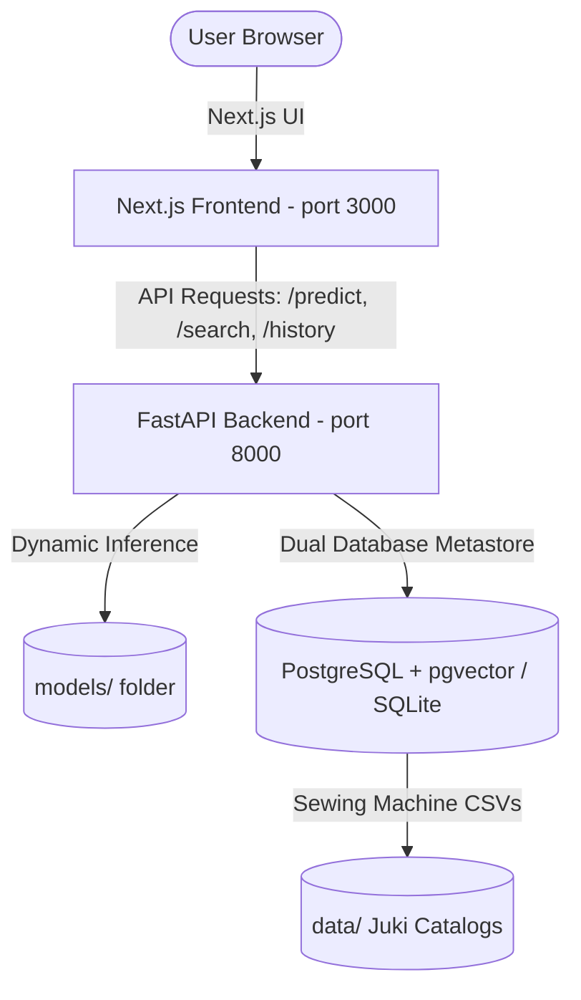

# System Architecture

This document describes the structural design, system boundaries, and database metastores of the FashionFlow AI application.

## System Boundaries

The application is decoupled into an independent frontend web client and a Python AI + database microservice:

### 1. Frontend Web Client (Next.js Node Server)
* Serves the collapsible Codinglab dashboard UI (Design Input, Sewing Sequence, Tooling Recommendations, etc.).
* Collects garment sketch uploads, image files, and version selections from the user.
* Sends API requests to the FastAPI backend and renders structured process sheets dynamically (coordinates overlays, step-by-step tables with matching part icons, and estimated SMVs).

### 2. Python AI & Database Microservice (FastAPI Uvicorn Service)
* Runs independently on port `8000`.
* **AI Engine**: Loads YOLOv11 and PyTorch/MobileNetV3 model weights from the `models/` folder dynamically based on user selections.
* **Database Metastore (`backend/db.py`)**: 
  * Automatically handles schema creation and database seeding.
  * Manages dual modes: SQLite (with numpy-based local vector search) or PostgreSQL (with native pgvector HNSW cosine searches).
  * Stores persistent analysis logs in the `analysis_history` table so that upload history is saved across server restarts.
  * Reads the cleaned Juki machinery catalogs (`data/2025_general_apparel_e.csv`) to match sewing steps with recommended machines.
