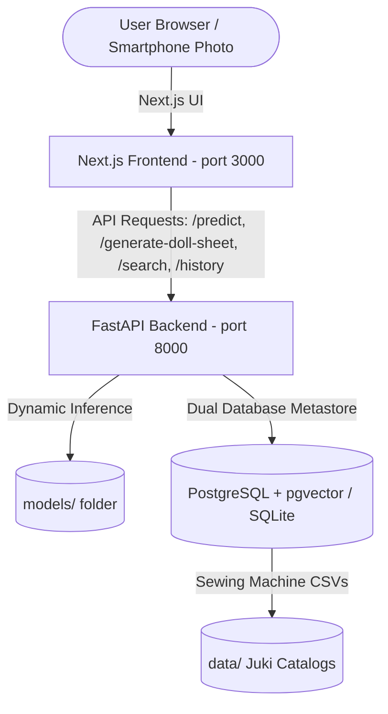

# System Architecture

This document describes the structural design, system boundaries, database metastores, and the end-to-end industrial computer vision pipeline of the FashionFlow AI application.

## System Boundaries

The application is decoupled into an independent frontend web client and a Python AI + database microservice:



### 1. Frontend Web Client (Next.js Node Server)
* Serves the collapsible Codinglab dashboard UI (Design Input, Sewing Sequence, Tooling Recommendations, Doll Outfit Configurator, etc.).
* Collects garment sketch uploads, physical smartphone photos, and doll parameters from the user.
* Sends API requests to the FastAPI backend and renders structured process sheets dynamically (coordinates overlays, step-by-step tables with matching part icons, multi-fabric breakdowns, and estimated SMVs).

### 2. Python AI & Database Microservice (FastAPI Uvicorn Service)
* Runs independently on port `8000`.
* **AI Engine**: Loads YOLOv11, PyTorch (MobileNetV3/ResNet/CLIP), and computer vision pre-processors.
* **Database Metastore (`backend/db.py`)**: 
  * Automatically handles schema creation and database seeding.
  * Manages dual modes: SQLite (with numpy-based local vector search) or PostgreSQL (with native pgvector HNSW cosine searches).
  * Stores persistent analysis logs in the `analysis_history` table so that upload history is saved across server restarts.
  * Reads the Juki machinery catalogs (`data/juki_master_catalog.csv`) to seed the historical knowledge database and serve machine specs details on startup.

---

## Industrial Computer Vision & Engineering Retrieval Pipeline

To adapt to real-world factory workflows at industrial manufacturing facilities (where engineers photograph physical paper sketches or finished dolls using smartphone cameras under non-standard lighting and angles), FashionFlow employs a modular, non-destructive image processing pipeline:

```text
Smartphone Camera Input (Paper Sketch / Physical Doll Photo)
                       │
                       ▼
1. Image Quality Assessment
   (Blur, brightness, and contrast validation)
                       │
                       ▼
2. Perspective Correction & Unwarping
   (OpenCV contour detection & perspective transform for paper sketches)
                       │
                       ▼
3. Object Localization (YOLOv11 / RT-DETR / Grounding DINO)
   (Detects bounding boxes for full garments or individual doll components)
                       │
                       ▼
4. Auto-Crop & Background Normalization
   (Isolates garment/component image and removes background noise)
                       │
                       ▼
5. Feature Extraction (DINOv2 / MobileNetV3 / CLIP)
   (Generates 512-dim visual vector embedding from normalized crop)
                       │
                       ▼
6. Vector Search & Engineering Knowledge Retrieval (pgvector + HNSW)
   (Queries vector database for top-K matching historical engineering records)
                       │
                       ▼
7. LLM + RAG Engineering Recommendation
   (Compiles sewing sequence, Juki machine choices, tooling specs, SMV, and lessons learned)
```

### Key Engineering Principles:
* **Zero Workflow Friction**: Engineers do not need flatbed scanners. They continue taking photos with their smartphones while FashionFlow normalizes the input behind the scenes.
* **Multi-Component Assembly ("LEGO" Concept)**: For doll outfit sets containing multiple garments (e.g. jacket, pants, hat), Object Localization detects each component separately, crops them individually, and executes parallel vector searches for each garment component.
* **Similarity Search as Gateway**: Similarity search is not the end goal; it is the entry door to retrieve full **Engineering Knowledge Records** (Sewing sequence, Juki machinery, SMV, lessons learned).

---

## WebGL/WebGPU 3D Asset Pipeline

* **Mannequin Base Mesh (Blender Preset)**: A low-poly mannequin model representing the doll torso, exported as a `.glb` binary asset.
* **Garment Meshes (Blender Presets)**: Standard garment types (Shirt, T-Shirt, Jacket, Pants, Skirt) modeled to fit the mannequin's dimensions, loaded/unloaded in React Three Fiber dynamically.
* **Dynamic Texture Mapping**: 2D fabric prints/motifs uploaded by artists/designers are processed as standard canvas textures and mapped in real-time onto the active 3D garment mesh material (UV coordinates). This provides instant visual alignment for designers and operators without expensive CPU/GPU cloth physics simulations.
